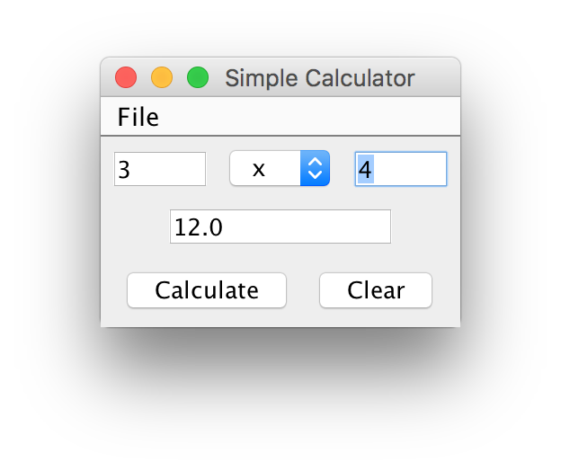

# legacy-calc #
This repository is part of a series of repositories documenting the code I wrote when I was first learning computer programming. Please do not use this repository to evaluate my professional software development skills. I keep these legacy repositories on Github for myself in order to look back on this code with nostalgia.

This code was last updated *August 30th, 2009*.
This code was committed to GitHub *October 2nd, 2017*.

Calc is a simple calculator program that performs basic math operations and implements a Java enum type. Unfortunately, the original source code is lost. I've included only the exported Jar.

For recent projects that demo current skills see: [https://github.com/jake-billings](https://github.com/jake-billings)
